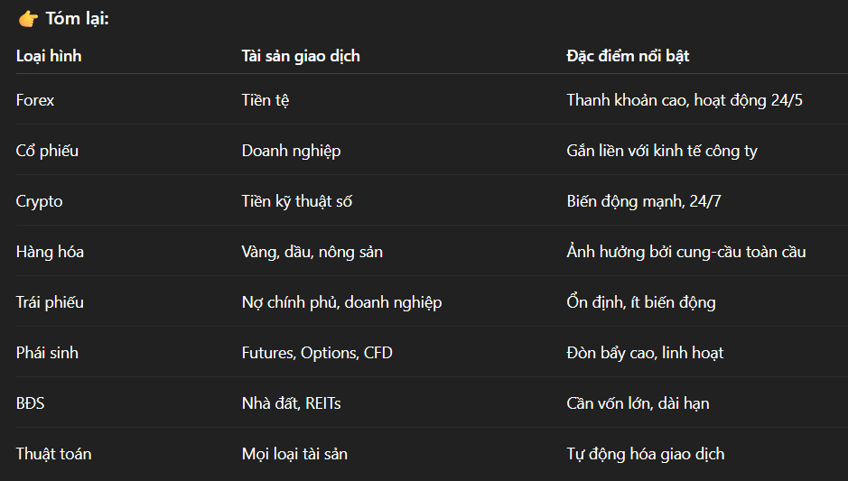

# Keyword
- Ký quỹ - Margin
    + Ký quỹ là số tiền bạn cần nạp hoặc giữ trong tài khoản để có thể mở một vị thế giao dịch.
    + Đây không phải là chi phí bạn mất đi mà là tiền đảm bảo cho sàn thấy bạn đủ khả năng giữ lệnh.
    + VD: bạn muốn mở 1 lệnh trị giá 100.000 EUR nhưng dùng đòn bẩy 1:100 ⇒ bạn chỉ cần ký quỹ 1000 EUR.

- Đòn bẩy tài chính – Leverage
    + Đòn bẩy cho phép bạn giao dịch với số tiền lớn hơn số vốn thật bạn có.
    + Nếu đòn bẩy là 1:100, nghĩa là bạn có 1 USD vốn thật thì có thể giao dịch giá trị 100 USD.

- Lệnh giao dịch – Trading Order
    + Là yêu cầu bạn gửi đến sàn giao dịch để mở, đóng hoặc sửa đổi một giao dịch.
    + 2 loại chính
        > Lệnh Mua (Buy / Long) – khi bạn kỳ vọng giá tăng.
        > Lệnh Bán (Sell / Short) – khi bạn kỳ vọng giá giảm.
        > VD: bạn đặt Buy EUR/USD nghĩa là bạn mua EUR và bán USD.

- Khớp lệnh (Order Matching)
    + Là quá trình hệ thống sàn giao dịch tự động ghép người mua và người bán có cùng mức giá để thực hiện giao dịch.
    + VD: Bạn đặt lệnh mua 1 BTC với giá $600 => Có người khác đặt lệnh bán 1 BTC cũng ở $600 => Hệ thống khớp lệnh hai bên lại với nhau, giao dịch xảy ra.
    + 2 loại khớp lệnh phổ biến
        > Lệnh thị trường (Market Order):
            - Hệ thống khớp ngay với giá tốt nhất đang có.
            - Ưu tiên tốc độ, không chắc giá chính xác.

        > Lệnh giới hạn (Limit Order)
            - Bạn tự chọn giá muốn mua/bán.
            - Hệ thống chỉ khớp khi có người chấp nhận giá đó.
            - Ưu tiên giá, nhưng có thể không khớp ngay.

# Financial Trading - Giao dịch tài chính

- Forex Trading
    + Là hoạt động mua và bán các cặp tiền tệ (như EUR/USD, USD/JPY, GBP/USD,...) nhằm kiếm lợi nhuận từ chênh lệch tỷ giá.
    + Khi bạn tin rằng EUR tăng so với USD, bạn mua EUR/USD.

- Stock Trading - Giao dịch cổ phiếu
    + Mua bán cổ phiếu của các công ty niêm yết
    + Kiếm lợi từ chênh lệch giá cổ phiếu hoặc nhận cổ tức.
    + VD: Mua cổ phiếu AAPL ở $150 và bán ở $170 → lãi $20/cổ phiếu.

- Index Trading - Giao dịch chỉ số chứng khoán

- Crypto Trading - Giao dịch tiền điện tử

- Commodities Trading - Giao dịch hàng hóa
    + Mua bán các hàng hóa như vàng, dầu, bạc, lúa mì, cà phê…
    + Cách giao dịch: Thông qua futures (hợp đồng tương lai) hoặc CFD (hợp đồng chênh lệch). 
    + Ví dụ: Mua vàng (XAU/USD) nếu dự đoán giá vàng tăng.

- Bond Trading - Giao dịch trái phiếu
    + Mua bán trái phiếu chính phủ hoặc doanh nghiệp.
    + Rủi ro thấp hơn cổ phiếu, nhưng lợi nhuận cũng thấp hơn.
    + VD: Mua trái phiếu Mỹ kỳ hạn 10 năm nếu tin rằng lãi suất sẽ giảm.

- Derivative Trading - Giao dịch phái sinh

- Real Estate Trading (Giao dịch bất động sản)

# I dunno
- options, futures, swaps, CFD

- Sàn tập trung (Centralized Exchange – CEX) 
    + Là sàn giao dịch có một tổ chức trung gian đứng giữa người mua và người bán, chịu trách nhiệm khớp lệnh, giữ tiền, giám sát và bảo đảm giao dịch.
    + NYSE, NASDAQ (chứng khoán), CME (phái sinh), Binance, Coinbase (crypto)

- Sàn phi tập trung (Decentralized Exchange – DEX)
    + Không có trung gian; giao dịch trực tiếp giữa người dùng với nhau (P2P) thông qua hợp đồng thông minh.
    + Uniswap, PancakeSwap, dYdX.

- Sàn OTC (Over-The-Counter)
    + Giao dịch trực tiếp giữa hai bên (thường qua môi giới), không qua sàn tập trung.
    + Dùng nhiều trong forex, trái phiếu, phái sinh.